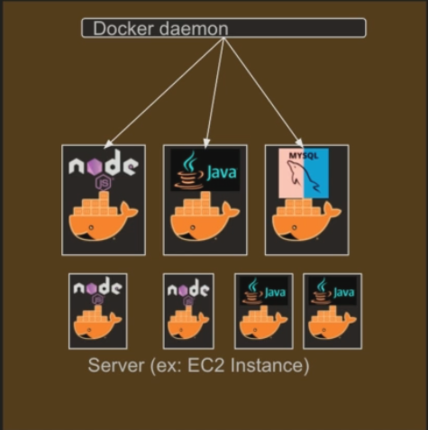
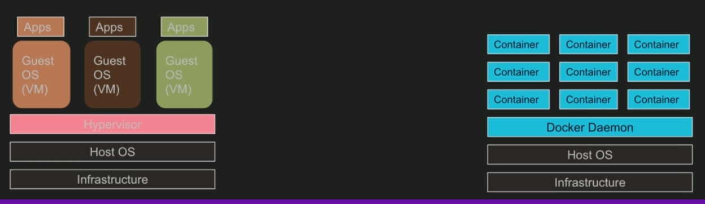

# Docker introduction

## What is docker?
* Docker is a software development platform to deploy apps
* Apps are packaged in containers that can be run on any OS
* App run the same regardless of where they are run
  * Any machine
  * No compatibility issues
  * Predictable behavior
  * Less work
  * Easier to maintain and deploy
  * Works with any language, any OS, any technology
* Scale containers up and down very quickly

## Docker daemon
Manages, builds, run dockers containers, along with docker agent

## Docker images: where are they stored?
They are stored in *docker repositories*
* Public repositories:
  * [Docker Hub](https://hub.docker.com/)
    * Find base images for many technologies and OS
      * Ubuntu
      * MySql
      * Nodejs, JAVA...
* Private repository
  * [Amazon ECR (Elastic Container Registry)](https://aws.amazon.com/pt/ecr/)

## Docker vs Virtual Machine
* Docker is "kind of" a virtualization technology, but not quite, it's a container technology
* Resources are shared with the host => many containers on one server

