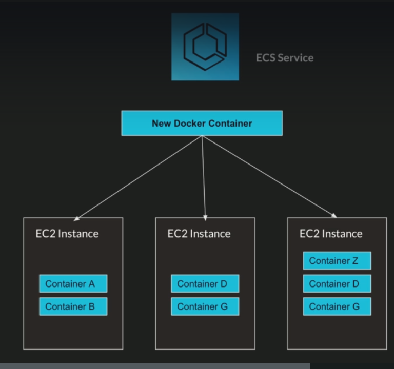

# ECS introduction

## What is ECS?
* ECS: Elastic Container Service
* Launch Docker Containers on AWS
* You must provision and maintain the infrastructure (the EC2 instances)
* AWS takes care of starting / stopping containers
* You can integrate application load balancer

