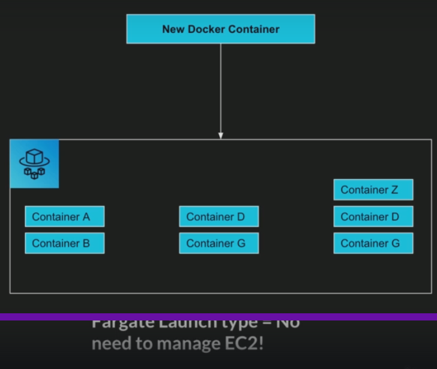

# Fargate

## What is fargate?
* Launch Docker Containers on AWS
* You do not provision and maintain infrastructure. No EC2 instances
* Serverless
* AWS just runs containers for you based on the CPU/RAM you need

